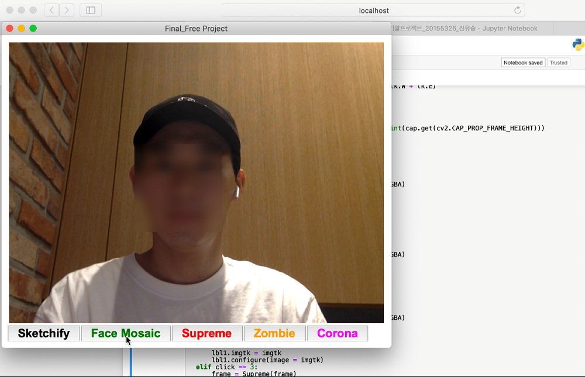
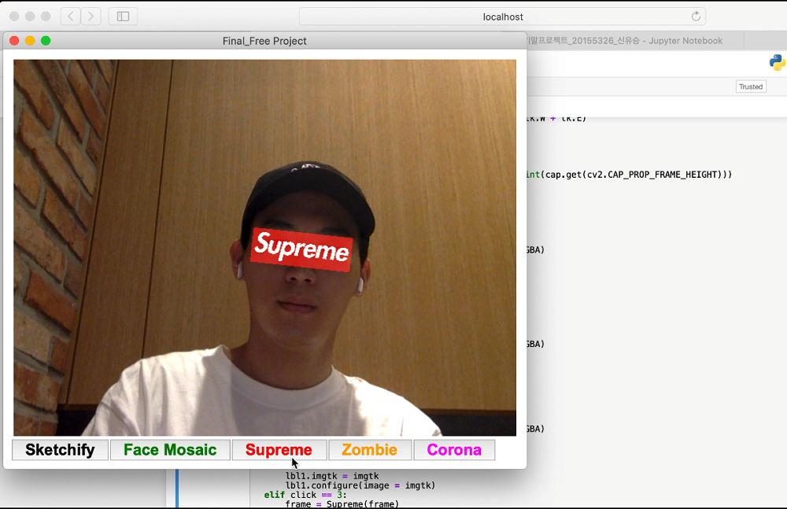

# Image Processing Programming Project

## 영상 처리 프로그래밍 자유 주제 프로젝트

학부 수강 과목 "영상 처리 프로그래밍"을 통해  
자유 주제 최종 프로젝트로 대중화된 애플리케이션 스노우(SNOW) 플랫폼 
얼굴 인식 스티커 코드 구현 
 

 

## 구동 영상 스크린샷
[\[영상 보기\]](./test_video.mov)

 

    
 image ⓒcopyright
 
img1(http://app.chosun.com/site/data/html_dir/2016/08/05/2016080502379.html)